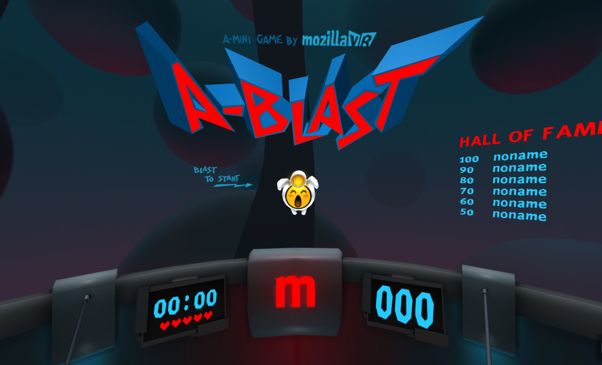
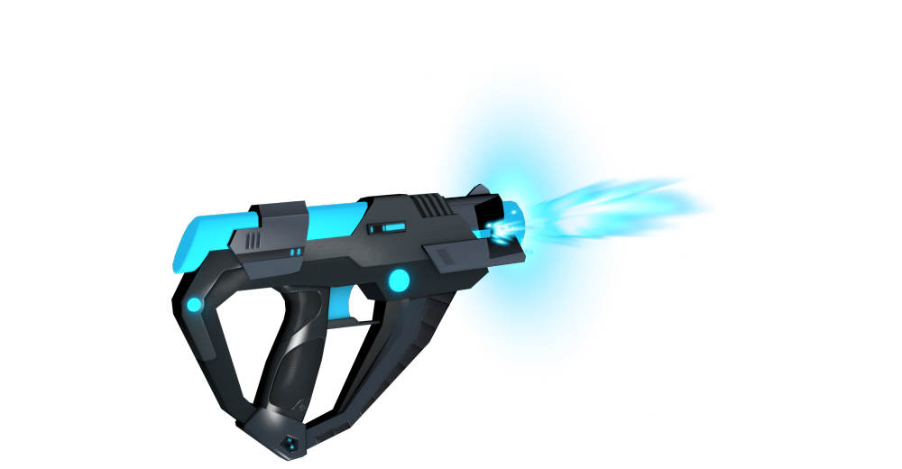

# A-Blast

A WebVR FPS mini-game demo using [A-Frame](http://aframe.io) by [Mozilla VR](http://mozvr.com).

[Read the introductory blog post.](https://blog.mozvr.com/a-blast/)

[](https://aframe.io/a-blast/)

## Usage

- Grab a [WebVR-enabled browser](https://webvr.info/).
- Head to [https://aframe.io/a-blast/](https://aframe.io/a-blast/) and start shooting. See the [blog post](https://blog.mozvr.com/a-blast/) for more information.
- You can also play in desktop using the spacebar and the mouse, and on your mobile phone too (with or without Cardboard).

<p align="center">
  
</p>

## Local Development

```bash
git clone git@github.com:aframevr/a-blast && cd a-blast
npm install
npm start
```

Then, load [`http://localhost:8080`](http://localhost:8080) in your browser.

We are opened to new ideas and contributions, feel free to send a pull request with your A-Blast improvements.

<p align="center">
  
</p>


Soundtrack by José Manuel Pérez Paredes AKA [JosSs](https://soundcloud.com/josss-1/tracks)
